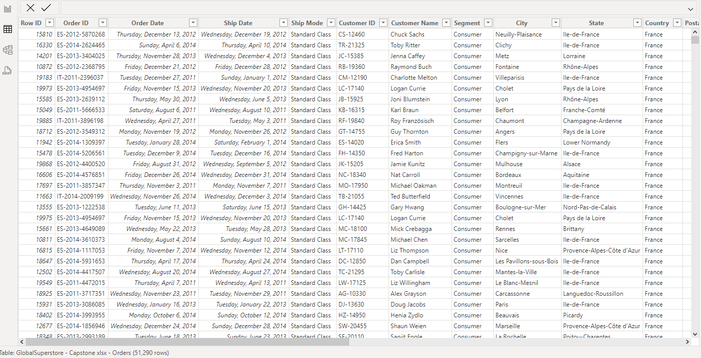
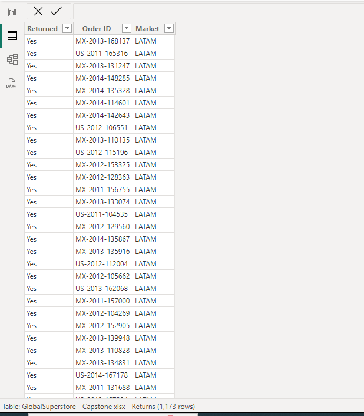
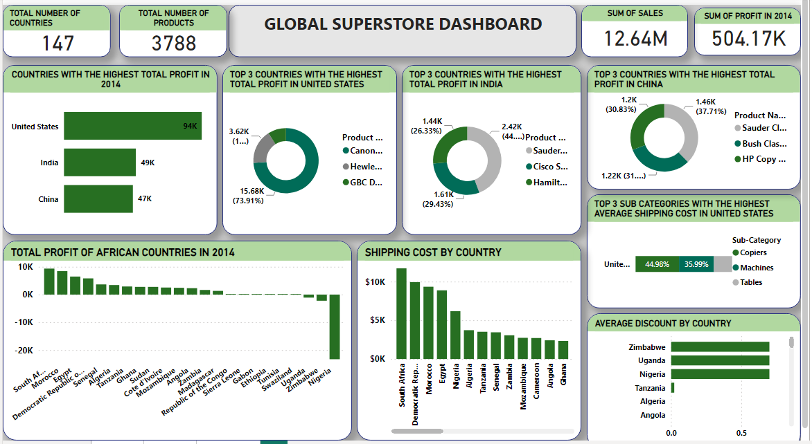
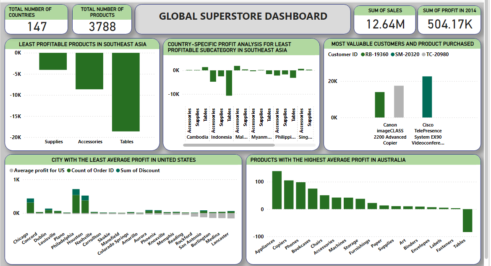

# Global-superstore-analysis

---

## Introduction

Global Superstore is a global online retailer based in New York, boasting a broad product catalog and
aiming to be a one-stop-shop for its customers. Global The superstore’s clientele, hailing from 147
different countries, can browse through an endless offering with more than 10,000 products. This large
selection comprises three main categories: office supplies (e.g., staples), furniture (e.g., chairs), and
technology (e.g., smartphones).

## Problem statement
1.	a) What are the three countries that generated the highest total profit for Global Superstore in 2014? 
b) For each of these three countries, find the three products with the highest total profit. Specifically, what are the products’ names and the total profit for each product?
2.	Identify the 3 subcategories with the highest average shipping cost in the United States
3.	a) Assess Nigeria’s profitability (i.e., total profit) for 2014. How does it compare to other African countries? 
b) What factors might be responsible for Nigeria’s poor performance? You might want to investigate shipping costs and the average discount as potential root causes.
4.	a) Identify the product subcategory that is the least profitable in Southeast Asia. Note: For this question, assume that Southeast Asia comprises Cambodia, Indonesia, Malaysia, Myanmar (Burma), the Philippines, Singapore, Thailand, and Vietnam.
 b) Is there a specific country i n Southeast Asia where Global Superstore should stop offering the subcategory identified in 4a?
5.	a) Which city is the least profitable (in terms of average profit) in the United States? For this analysis, discard the cities with less than 10 Orders.
 b) Why is this city’s average profit so low?
6.	Which product subcategory has the highest average profit in Australia?
7.	Who are the most valuable customers and what do they purchase?

## Skills/ concepts demonstrated:
The following power bi features were incorporated:
- Data cleaning,
- New measure,
- New column,
- Filtering

  ## Visualization
  The report consists of:
- Orders,
- People,
- Returns

  You can see the dataset here
  
  
  

  Features:
  My dashboard features include;
- Donut chart
- Slicer
- Stacked bar chart
- Stacked column chart
- Clustered column chart
- 100% Stacked bar chart

  ## Analysis
  The three countries that generated the highest total profit for Global Superstore in 2014 are the United States, India, and China.
In the United States, the most profitable products were:
•	Canon imageCLASS 2200 Advanced Copier with a total profit of $15,679.96
•	Hewlett Packard Laserjet 3310 Copier with a total profit of $3,623.94
•	GBC DocuBind TL300 Electric Binding System with a total profit of $1,910.59
In India, the top products were:
•	Sauder Classic Bookcase Traditional with a total profit of $2,419.65
•	Cisco Smart Phone with Caller ID with a total profit of $1,609.38
•	Hamilton Beach Refrigerator Red with a total profit of $1,440.24
In China, the leading products were:
•	Sauder Classic Bookcase Metal with a total profit of $1,463.07
•	Bush Classic Bookcase Mobile with a total profit of $1,220.52
•	HP Copy Machine Color with a total profit of $1,196.13
The subcategories with the highest average shipping costs in the United States are copiers, machines, and tables.
Nigeria's total profit in 2014 was very low compared to other African countries. The average discount in Nigeria was very high, which likely contributed to its low profit and poor performance.
The product subcategories that were the least profitable in Southeast Asia are supplies, accessories, and tables. Global Superstore should consider discontinuing these subcategories in Indonesia, as they generate very low profits.
The city with the least profit in terms of average profit in the United States is Lancaster.
In Australia, the product subcategory with the highest average profit is appliances.
The most valuable customers are those with customer IDs TA-21385, TC-20980, and TM-20320. They purchased the Canon imageCLASS 2200 Advanced Copier and the Cisco Telepresence System EX90 Videoconferencing Unit

## Global superstore dashboard:

## Conclusion and recommendation
### Conclusion:
The analysis of Global Superstore's sales and profit data for 2014 has revealed several key insights. The United States, India, and China emerged as the top three countries in terms of total profit. In the United States, products like the Canon imageCLASS 2200 Advanced Copier and Hewlett Packard Laserjet 3310 Copier generated the highest profits. India and China also showed strong performance with specific high-profit products such as the Sauder Classic Bookcase and Cisco Smart Phone.
However, certain regions and product subcategories performed poorly. Nigeria's low total profit, coupled with its high average discount, indicates a need for strategic pricing adjustments. In Southeast Asia, subcategories like supplies, accessories, and tables were the least profitable, particularly in Indonesia.
Furthermore, Lancaster in the United States recorded the lowest average profit among cities, while appliances proved to be the most profitable subcategory in Australia. Identifying valuable customers, such as those with IDs TA-21385, TC-20980, and TM-20320, can help target high-value sales opportunities.
### Recommendations:
1.	Focus on High-Profit Products: Continue to promote and prioritize high-profit products identified in the United States, India, and China. This includes maintaining inventory levels and marketing efforts for items like the Canon imageCLASS 2200 Advanced Copier and Sauder Classic Bookcase.
2.	Adjust Pricing Strategies in Nigeria: Review and adjust the discount strategies in Nigeria to improve profitability. Implement targeted promotions and evaluate the pricing structure to reduce excessive discounting.
3.	Discontinue Low-Profit Subcategories in Southeast Asia: Consider discontinuing the supplies, accessories, and tables subcategories in Indonesia due to their low profitability. Focus on more profitable product lines to enhance overall performance in the region.
4.	Analyze Shipping Costs: Conduct a detailed analysis of shipping costs for high-cost subcategories in the United States, such as copiers, machines, and tables. Explore cost-saving measures in logistics and supply chain management to improve margins.
5.	Target High-Value Customers: Develop loyalty programs and targeted marketing campaigns for the most valuable customers (e.g., those with IDs TA-21385, TC-20980, and TM-20320). Offering personalized incentives can enhance customer retention and increase sales.
6.	Improve Profitability in Low-Performing Cities: Investigate the factors contributing to low profitability in cities like Lancaster. Implement localized marketing strategies and evaluate product offerings to better meet the needs of these markets.
By implementing these recommendations, Global Superstore can optimize its product offerings, enhance profitability, and strategically target key markets and customer segments.

